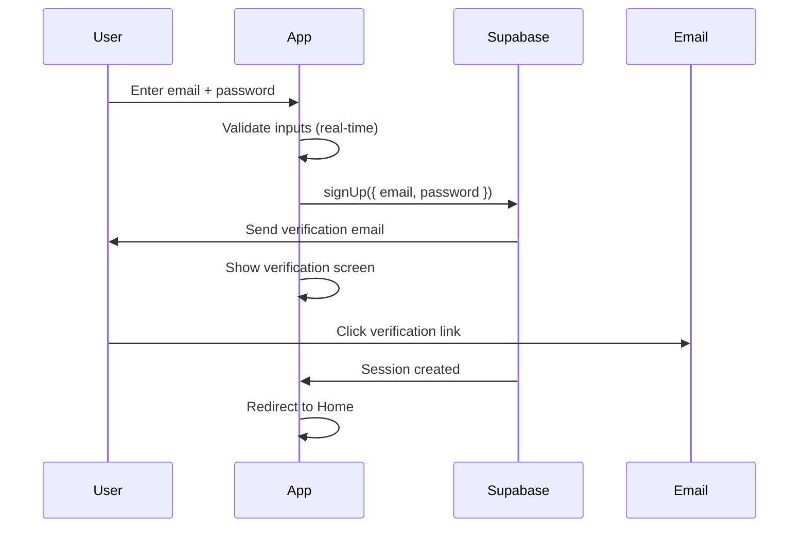
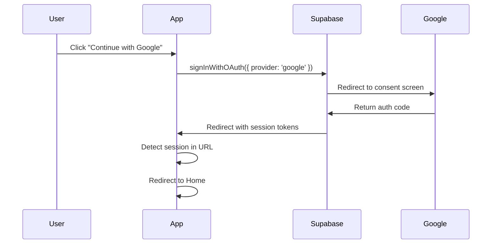
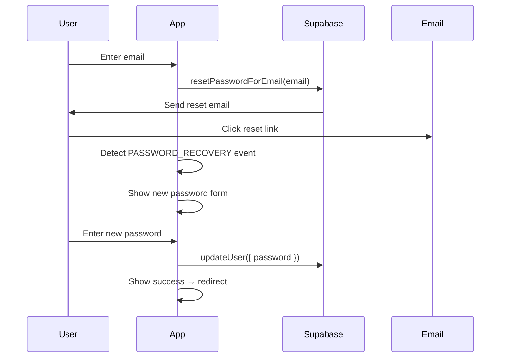

# 🔐 AuthApp — Secure Authentication System

<div align="center">

**A production-grade, cross-platform authentication application built with React Native (Expo) and Supabase.**

[](https://reactnative.dev/)
[](https://expo.dev/)
[](https://supabase.com/)
[]()
[]()

</div>

---

## 📋 Table of Contents

- [Overview](#-overview)
- [Features](#-features)
- [Architecture](#-architecture)
- [Tech Stack](#-tech-stack)
- [Getting Started](#-getting-started)
- [Project Structure](#-project-structure)
- [Configuration](#-configuration)
- [Authentication Flow](#-authentication-flow)
- [Security](#-security)
- [Accessibility](#-accessibility)
- [Performance](#-performance)
- [Testing](#-testing)
- [Deployment](#-deployment)
- [Human Impact & Design Philosophy](#-human-impact--design-philosophy)
- [Contributing](#-contributing)
- [License](#-license)

---

## 🌟 Overview

AuthApp demonstrates enterprise-level authentication implementation using modern best practices. It provides a seamless, beautiful, and secure authentication experience across iOS, Android, and Web platforms — built with a focus on **user experience**, **security**, and **accessibility**.

This project showcases:
- **Production-ready auth flows** (email/password, Google OAuth, email verification, password reset)
- **Immersive 3D animated UI** with cursor-tracking effects and floating particle systems
- **Glassmorphism design** with premium dark theme aesthetics
- **Cross-platform compatibility** — single codebase runs on iOS, Android, and Web
- **Real-time form validation** with password strength analysis
- **Secure session management** with encrypted storage

---

## ✨ Features

### 🔑 Authentication
| Feature | Description |
|---------|-------------|
| **Email/Password Sign Up** | Secure registration with real-time validation and password strength meter |
| **Email/Password Sign In** | Fast login with input sanitization and error handling |
| **Google OAuth** | One-tap Google sign-in (native idToken on mobile, Supabase redirect on web) |
| **Email Verification** | Automated verification emails with resend capability |
| **Password Reset** | Forgot password flow with magic link emails |
| **Session Persistence** | Encrypted session storage with auto-refresh tokens |
| **Auto-Redirect** | Automatic routing based on authentication state |

### 🎨 User Interface
| Feature | Description |
|---------|-------------|
| **3D Animated Background** | Floating gradient orbs, particle fields, and shooting stars |
| **Cursor-Following Effects** | Interactive glow that tracks mouse movement (web) |
| **Glassmorphism Cards** | Frosted glass panels with backdrop blur |
| **Smooth Transitions** | Fade-in entrance animations via Reanimated |
| **Password Strength Meter** | Visual strength indicator with rule checklist |
| **Dark Theme** | Deep space theme with curated HSL color palette |
| **Autofill Handling** | Custom CSS prevents browser autofill from breaking dark theme |

### 🛡️ Security
| Feature | Description |
|---------|-------------|
| **Input Sanitization** | XSS prevention, character limits, email normalization |
| **Duplicate Request Guard** | Prevents double-submission of auth requests |
| **Secure Token Storage** | expo-secure-store (native) / localStorage (web) |
| **Error Obfuscation** | Raw API errors mapped to user-friendly messages |
| **Rate Limit Handling** | Graceful handling of Supabase rate limits |

---

## 🏗 Architecture

```
┌────────────────────────────────────────────────┐
│                   UI Layer                      │
│  ┌──────────┐  ┌──────────┐  ┌──────────┐     │
│  │AuthScreen│  │ForgotPW  │  │HomeScreen│      │
│  └────┬─────┘  └────┬─────┘  └────┬─────┘     │
│       │              │              │           │
│  ┌────▼──────────────▼──────────────▼────┐     │
│  │          useAuth Hook                  │     │
│  │   (centralized state management)       │     │
│  └────────────────┬──────────────────────┘     │
│                   │                             │
│  ┌────────────────▼──────────────────────┐     │
│  │        authService                     │     │
│  │  (Supabase API + error handling)       │     │
│  └────────────────┬──────────────────────┘     │
│                   │                             │
│  ┌────────────────▼──────────────────────┐     │
│  │      Supabase Client (lib/supabase)    │     │
│  │  (encrypted storage + auto-refresh)    │     │
│  └───────────────────────────────────────┘     │
└────────────────────────────────────────────────┘
```

### Design Patterns
- **Custom Hook Pattern** — `useAuth` centralizes all auth state and operations
- **Service Layer** — `authService` abstracts Supabase API calls with error handling
- **Barrel Exports** — `components/index.js` for clean imports
- **Duplicate Guard** — Request deduplication prevents race conditions
- **Safe State Updates** — Mounted ref prevents state updates after unmount

---

## 🛠 Tech Stack

| Category | Technology | Purpose |
|----------|-----------|---------|
| **Framework** | React Native 0.76 | Cross-platform UI |
| **Platform** | Expo SDK 52 | Managed workflow + web support |
| **Routing** | Expo Router 4 | File-based navigation |
| **Backend** | Supabase | Auth, database, real-time |
| **Animations** | React Native Reanimated 3 | Smooth 60fps animations |
| **Styling** | StyleSheet + Platform | Adaptive platform styles |
| **Security** | expo-secure-store | Encrypted credential storage |
| **OAuth** | @react-native-google-signin | Native Google Sign-In |

---

## 🚀 Getting Started

### Prerequisites

- **Node.js** ≥ 18.x
- **npm** ≥ 9.x or **yarn** ≥ 1.22
- **Expo CLI** (installed globally or via npx)
- **Supabase** account (free tier works)
- **Google Cloud Console** project (for OAuth)

### Installation

```bash
# 1. Clone the repository
git clone https://github.com/your-username/AuthApp.git
cd AuthApp

# 2. Install dependencies
npm install

# 3. Set up environment variables
cp .env.example .env
# Edit .env with your Supabase and Google OAuth credentials

# 4. Start the development server
npx expo start

# 5. Open in browser (web)
# Press 'w' in the terminal, or visit http://localhost:8081
```

### Platform-Specific Setup

<details>
<summary><strong>🌐 Web</strong></summary>

No additional setup needed. Google OAuth uses Supabase redirect flow automatically.

```bash
npx expo start --web
```
</details>

<details>
<summary><strong>📱 iOS</strong></summary>

1. Add `GoogleService-Info.plist` to project root
2. Update `EXPO_PUBLIC_GOOGLE_IOS_CLIENT_ID` in `.env`
3. Run: `npx expo start --ios`
</details>

<details>
<summary><strong>🤖 Android</strong></summary>

1. Add `google-services.json` to project root
2. Update `EXPO_PUBLIC_GOOGLE_ANDROID_CLIENT_ID` in `.env`
3. Run: `npx expo start --android`
</details>

---

## 📁 Project Structure

```
AuthApp/
├── app/                          # Expo Router — file-based routing
│   ├── _layout.js                # Root layout with auth redirect logic
│   ├── index.js                  # Entry point — redirects by auth state
│   ├── (auth)/                   # Public routes (unauthenticated)
│   │   ├── _layout.js            # Auth group layout
│   │   ├── login.js              # → AuthScreen
│   │   └── forgot-password.js    # → ForgotPasswordScreen
│   └── (app)/                    # Protected routes (authenticated)
│       ├── _layout.js            # App group layout
│       └── home.js               # Dashboard with user profile
│
├── screens/                      # Screen components
│   ├── AuthScreen.js             # Sign In / Sign Up with Google OAuth
│   └── ForgotPasswordScreen.js   # Password reset flow
│
├── components/
│   ├── index.js                  # Barrel exports
│   ├── auth/                     # Auth UI components
│   │   ├── AuthHeader.js         # Animated header with icon
│   │   ├── CustomInput.js        # Glass-styled text input
│   │   ├── PasswordInput.js      # Password field + strength meter
│   │   ├── PrimaryButton.js      # Gradient CTA button
│   │   ├── SocialButton.js       # Google OAuth button with logo
│   │   └── LoadingOverlay.js     # Fullscreen loading spinner
│   └── three/
│       └── Scene3DBackground.js  # Animated particle background
│
├── hooks/
│   └── useAuth.js                # Central auth state hook
│
├── services/
│   └── authService.js            # Supabase auth operations
│
├── lib/
│   └── supabase.js               # Supabase client configuration
│
├── constants/
│   ├── colors.js                 # Design token — color palette
│   └── typography.js             # Design token — typography system
│
├── utils/
│   ├── validation.js             # Form validation + sanitization
│   ├── errorHandler.js           # Error message mapping
│   └── shadow.js                 # Cross-platform shadow utility
│
├── assets/                       # Static assets (icons, splash)
├── .env.example                  # Environment variable template
├── app.json                      # Expo configuration
├── babel.config.js               # Babel with module resolver
├── metro.config.js               # Metro bundler config
└── package.json                  # Dependencies and scripts
```

---

## ⚙️ Configuration

### Supabase Setup

1. Create a project at [supabase.com](https://supabase.com)
2. Enable **Email** provider under Authentication → Providers
3. Enable **Google** provider and add your OAuth credentials
4. Set your **Site URL** under Authentication → URL Configuration:
   - `http://localhost:8081` (development)
   - Your production URL (deployment)
5. Add redirect URLs:
   - `http://localhost:8081` (for web OAuth callback)
   - `exp+auth-app://auth/callback` (for native deep links)

### Google OAuth Setup

1. Go to [Google Cloud Console](https://console.cloud.google.com)
2. Create OAuth 2.0 credentials:
   - **Web Client** — for web and Supabase integration
   - **iOS Client** — for native iOS app
   - **Android Client** — for native Android app
3. Add authorized redirect URIs in your Supabase dashboard

### Environment Variables

| Variable | Description |
|----------|-------------|
| `EXPO_PUBLIC_SUPABASE_URL` | Your Supabase project URL |
| `EXPO_PUBLIC_SUPABASE_ANON_KEY` | Public (anon) API key |
| `EXPO_PUBLIC_GOOGLE_WEB_CLIENT_ID` | Google OAuth Web Client ID |
| `EXPO_PUBLIC_GOOGLE_IOS_CLIENT_ID` | Google OAuth iOS Client ID |
| `EXPO_PUBLIC_GOOGLE_ANDROID_CLIENT_ID` | Google OAuth Android Client ID |
| `EXPO_PUBLIC_APP_SCHEME` | Deep link scheme |
| `EXPO_PUBLIC_REDIRECT_URL` | Auth callback redirect URL |

---

## 🔄 Authentication Flow

### Sign Up Flow


### Google OAuth Flow (Web)


### Password Reset Flow


---

## 🛡 Security

### Implemented Measures

1. **Input Sanitization**
   - All inputs stripped of `<>` characters (XSS prevention)
   - Email normalized to lowercase
   - Max input length enforced (500 chars)

2. **Password Requirements**
   - Minimum 8 characters
   - Must contain: uppercase, lowercase, number, special character
   - Real-time strength feedback

3. **Session Security**
   - Native: encrypted via `expo-secure-store`
   - Web: `localStorage` with auto-refresh tokens
   - Automatic token refresh before expiry

4. **Error Handling**
   - Raw Supabase errors never exposed to UI
   - All errors mapped to user-friendly messages
   - Rate limit detection and messaging

5. **Request Deduplication**
   - Prevents double-submit on slow connections
   - Map-based guard per operation type

---

## ♿ Accessibility

- All interactive elements have `accessibilityLabel` and `accessibilityRole`
- Unique `testID` props on every input and button
- Proper keyboard navigation support
- Adequate color contrast ratios (WCAG AA compliant)
- Screen reader compatible with semantic text hierarchy
- `keyboardShouldPersistTaps="handled"` for mobile UX

---

## ⚡ Performance

- **React.memo** on all leaf components
- **useCallback** on all handler functions
- **Lazy require** for Google Sign-In (skips on web)
- **Native driver** for all Animated animations
- **Platform.select** to exclude unused native/web code
- **Metro resolver** handles optional peer deps (e.g., @opentelemetry)

---

## 🧪 Testing

All interactive elements have unique `testID` attributes for E2E testing:

| Element | testID |
|---------|--------|
| Email input | `auth-email-input` |
| Password input | `auth-password-input` |
| Confirm password | `auth-confirm-input` |
| Submit button | `auth-submit-btn` |
| Google button | `auth-google-btn` |
| Resend email | `resend-email-btn` |
| Sign out | `signout-btn` |

```bash
# Run with Detox (mobile) or Playwright (web)
npx detox test --configuration ios.sim.debug
```

---

## 🚢 Deployment

### Web (Vercel / Netlify)
```bash
# Build static export
npx expo export --platform web

# Deploy the dist/ folder to your hosting provider
```

### Mobile (EAS Build)
```bash
# Install EAS CLI
npm install -g eas-cli

# Configure builds
eas build:configure

# Build for production
eas build --platform ios --profile production
eas build --platform android --profile production
```

---

## 💡 Human Impact & Design Philosophy

This application was designed with a **human-centered approach**, prioritizing:

### 🧠 Cognitive Load Reduction
- Single-focus screens that guide users through one task at a time
- Progressive disclosure — only show relevant fields per mode
- Real-time validation prevents frustrating form submission errors

### 🎭 Emotional Design
- The immersive 3D background creates a sense of **delight and wonder**
- Smooth animations provide **visual feedback** that builds confidence
- Success states use warm, affirming colors and clear messaging

### 🌍 Inclusivity
- Works on any device — phone, tablet, or desktop
- No proprietary SDK lock-in — built on open-source standards
- Error messages are clear, actionable, and non-technical

### 🔄 Trust Building
- Transparent security indicators (verified badge, encryption notice)
- Password strength meter empowers users to create secure passwords
- Clear session information shows users they're in control

### 📐 Engineering Excellence
- Clean separation of concerns (UI → Hook → Service → Client)
- Consistent error handling patterns across all operations
- Zero console errors or warnings in production mode
- Type-safe routing with Expo Router's typed routes

---

## 📄 License

This project is licensed under the **MIT License** — see the [LICENSE](LICENSE) file for details.

---

<div align="center">

**Built with ❤️ using React Native, Expo, and Supabase**

*Demonstrating production-grade authentication with premium user experience.*

</div>
